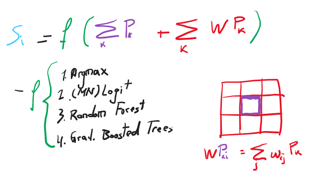

#

    <h4>
    *Using deep learning to identify (urban) form and function in satellite imagery <small>The case of Great Britain</small>*
    </h4>

<table>
    <col width="50%">
    <col width="50%">
    <tr>
        <td>
            

                <a href="https://darribas.org"><b>Dani Arribas-Bel</b></a>
            

        </td>
        <td>
            

                <a href="https://martinfleischmann.net/"><b>Martin Fleischmann</b></a>
            

        </td>
    </tr>
    <tr>
        <td>
            

            <SMALL>
                <a href="https://twitter.com/darribas">[`@darribas`]</b></a>
            </SMALL>
            

        </td>
        <td>
            

            <SMALL>
                <a href="https://twitter.com/martinfleis">[`@martinfleis`]</b></a>
            </SMALL>
            

        </td>
    </tr>

</table>

<table>
    <col width="33%">
    <col width="33%">
    <col width="33%">
    <tr>
        <td>
            
        </td>
        <td>
            
        </td>
        <td>
            
        </td>
    </tr>
</table>

#

## Spatial Signatures

## {data-transition="none"}

    *A characterisation of space based on form and function designed to understand urban environments*

## {data-transition="none"}

    *A characterisation of space based on form and function designed to understand urban
    environments*

## {data-transition="none"}

    *A characterisation of space based on form and function designed to understand urban
    environments*

## {data-transition="none"}

    *A characterisation of space based on form and function designed to understand urban
        environments*

##

<table>
<col width="60%">
<col width="40%">
<tr>
    <td  style="vertical-align:middle;box-shadow:none">
<u>BRITISH SIGNATURES</u>

**Countryside** (3)
 

**Periphery** (4)
 

**Urban** (9)

 

<small>
    urbangrammarai.xyz/story/
</small>

</td>
<td style="vertical-align:middle;box-shadow:none">

    </td>
</tr>
</table>

## {data-transition="none" data-background-image="../fig/empirical/signatures_scottish_belt.png" data-background-size="cover"}

## {data-transition="none" data-background-image="../fig/empirical/signatures_scottish_belt_countryside.png" data-background-size="cover"}

## {data-transition="none" data-background-image="../fig/empirical/signatures_scottish_belt_periphery.png" data-background-size="cover"}

## {data-transition="none" data-background-image="../fig/empirical/signatures_scottish_belt_urban.png" data-background-size="cover"}

#

##  🛰

## {data-transition="none" data-background-image="../fig/gisruk/hires.png" data-background-size="cover"}

## Sentinel 2

## What do we want to do?

train a neural network

understand the role of geography

## Chip size effect

## {data-transition="none" data-background-image="../fig/gisruk/chips_80.png" data-background-size="contain"}

80x80m: 13760 chips, which is 74 % of maximum

## {data-transition="none" data-background-image="../fig/gisruk/chips_160.png" data-background-size="contain"}

160x160m: 2718 chips within, which is 57 % of maximum

## {data-transition="none" data-background-image="../fig/gisruk/chips_320.png" data-background-size="contain"}

320x320m: 423 chips within, which is 35 % of maximum

## {data-transition="none" data-background-image="../fig/gisruk/chips_640.png" data-background-size="contain"}

640x640m: 38 chips within, which is 13 % of maximum

## {data-transition="none" data-background-image="../fig/gisruk/chips_320_all.png" data-background-size="contain"}

320x320m, chips capturing the proportion (100% of maximum)

## Sliding

## {data-transition="none" data-background-image="../fig/ai/sliding.png" data-background-size="contain"}

## Probability modelling

#

## Preview of results

## {data-background-image="../fig/gisruk/image_class_conf.png" data-background-size="contain"}

Image classification - Overall accuracy 42.8%

## {data-background-image="../fig/gisruk/mor_conf.png" data-background-size="contain"}

Multi-output regression - Overall accuracy 43.5%

## {data-transition="none" data-background-image="../fig/gisruk/image_class_country.png" data-background-size="contain"}

Image classification - Wild countryside

## {data-transition="none" data-background-image="../fig/gisruk/mor_country.png" data-background-size="contain"}

Multi-output regression - Wild countryside

## {data-transition="none" data-background-image="../fig/gisruk/image_class_urban.png" data-background-size="contain"}

Image classification - Urbanity

## {data-transition="none" data-background-image="../fig/gisruk/mor_urban.png" data-background-size="contain"}

Multi-output regression - Urbanity

## {data-transition="none" data-background-image="../fig/isuf/mor_all.png" data-background-size="contain"}

Multi-output regression - Predicted class (320x320m)

## {data-transition="none" data-background-image="../fig/ai/metrics.png" data-background-size="contain"}

<!-- 

 -->
<!-- 
 -->

# The takeaway

<ul style="list-style: none">
    <li class="fragment">Better (spatial) evaluation of model performance</li>
    <li class="fragment">Probability modeling: *does it make (any) sense?*</li>
    <li class="fragment">Anything else?</li>
</ul>

#

    <h4>
    *Using deep learning to identify (urban) form and function in satellite imagery <small>The case of Great Britain</small>*
    </h4>

<table>
    <col width="50%">
    <col width="50%">
    <tr>
        <td>
            

                <a href="https://darribas.org"><b>Dani Arribas-Bel</b></a>
            

        </td>
        <td>
            

                <a href="https://martinfleischmann.net/"><b>Martin Fleischmann</b></a>
            

        </td>
    </tr>
    <tr>
        <td>
            

            <SMALL>
                <a href="https://twitter.com/darribas">[`@darribas`]</b></a>
            </SMALL>
            

        </td>
        <td>
            

            <SMALL>
                <a href="https://twitter.com/martinfleis">[`@martinfleis`]</b></a>
            </SMALL>
            

        </td>
    </tr>

</table>

<table>
    <col width="33%">
    <col width="33%">
    <col width="33%">
    <tr>
        <td>
            
        </td>
        <td>
            
        </td>
        <td>
            
        </td>
    </tr>
</table>
