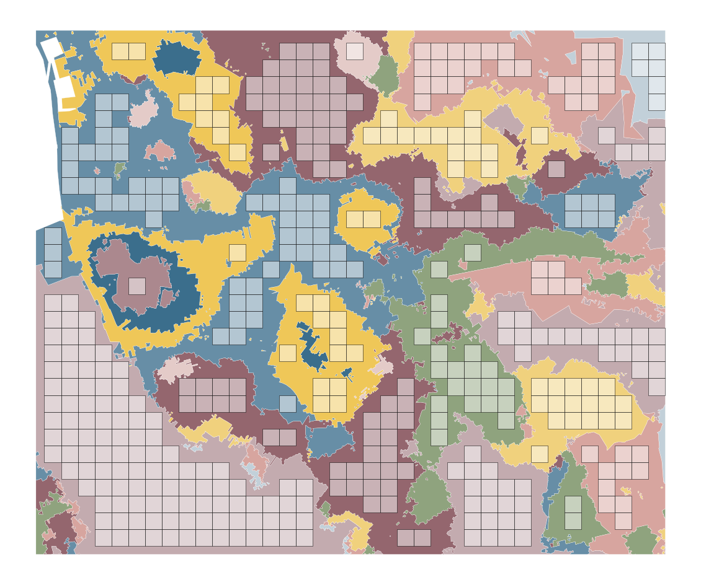
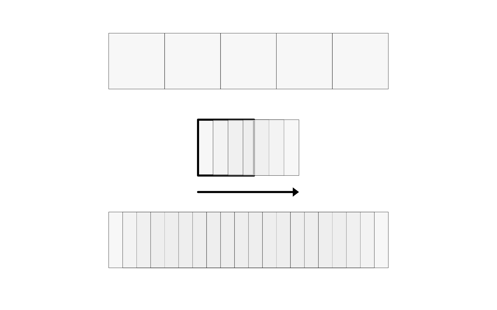

# Urban Grammar

    <h4>
    *"Learning from Deep Learning"*  
    <SMALL>
    *Lessons from using computer vision to identify (urban)
form and function in open data satellite imagery*
    </SMALL>
    </h4>

**UCL-QML Turing workshop**

<table>
    <col width="50%">
    <col width="50%">
    <tr>
        <td>
            

                <a href="https://darribas.org"><b>Dani Arribas-Bel</b></a>
                 `@darribas`
            

        </td>
        <td>
            

                <a href="https://martinfleischmann.net/"><b>Martin Fleischmann</b></a>
                 `@martinfleis`
            

        </td>
    </tr>

</table>

<table>
    <col width="33%">
    <col width="33%">
    <col width="33%">
    <tr>
        <td>
            
        </td>
        <td>
            
        </td>
        <td>
            
        </td>
    </tr>
</table>

#
## {data-transition="none" data-background-image="../fig/misc/urban_grammar_project.png" data-background-size="contain"}

## "Previous season..."

## {data-transition="none" data-background-image="../fig/gb/signatures_summary.png" data-background-size="contain"}

## This "season"

***What***

Explore the extent to which neural networks can recognise spatial signatures
from satellite imagery

***Why***

- Learn about Spatial Signatures (scale, context)
- Explore the potential of NNs for cities
- Work towards more frequent Spatial Signatures

#
## Experiments setup

## {data-transition="none" data-background-image="../fig/ai/data_sources.png" data-background-size="cover"}

## Dimensions to explore

## Chip size
<table>
    <col width="25%">
    <col width="25%">
    <col width="25%">
    <col width="25%">
    <tr>
        <td>
        

        
         
        <SMALL>[74%]</SMALL>
        

        </td>
        <td>
        

        
         
        <SMALL>[57%]</SMALL>
        

        </td>
        <td>
        

        
         
        <SMALL>[35%]</SMALL>
        

        </td>
        <td>
        

        
         
        <SMALL>[13%]</SMALL>
        

        </td>
    </tr>
</table>

## (Spatial) data augmentation

## Model architecture

<table>
<col width="30%">
<col width="70%">
<tr>
<td>
`EfficientNetB4`

- Image Classification
- Multi-Output Regression
</td>
<td class='fragment'>

</td>
</tr>
</table>

## Evaluation

<table>
    <col width="35%">
    <col width="65%">
    <tr>
        <td>
`Metrics`

- Standard   [$\kappa$, accuracy, F1]()
- Spatial   [Joint Counts]()
        </td>
<td class='fragment'>
`Summarisation`
 

 

        </td>
    </tr>
</table>

#
## Results

## {data-transition="none" data-background-image="../fig/ai/results_table_1.png" data-background-size="contain"}
## {data-transition="none" data-background-image="../fig/ai/results_table_2.png" data-background-size="contain"}
## {data-transition="none" data-background-image="../fig/ai/results_table_3.png" data-background-size="contain"}

## Summarisation summary

- Extra ML pays off
- M.O.R. worse in general, better _within_ class
- Spatial context *always* improves performance
- Scale: larger is better, except for spatial patterning
- Spatial sliding rarely (within-class)

#
## Conclusions

- Space matters for the spatial signatures
- There's value in combining NNs & other ML
- A _bit_ closer to frequent Spatial Signatures

# Urban Grammar

    <h4>
    *"Learning from Deep Learning"*  
    <SMALL>
    *Lessons from using computer vision to identify (urban)
form and function in open data satellite imagery*
    </SMALL>
    </h4>

**UCL-QML Turing workshop**

<table>
    <col width="50%">
    <col width="50%">
    <tr>
        <td>
            

                <a href="https://darribas.org"><b>Dani Arribas-Bel</b></a>
                 `@darribas`
            

        </td>
        <td>
            

                <a href="https://martinfleischmann.net/"><b>Martin Fleischmann</b></a>
                 `@martinfleis`
            

        </td>
    </tr>

</table>

<table>
    <col width="33%">
    <col width="33%">
    <col width="33%">
    <tr>
        <td>
            
        </td>
        <td>
            
        </td>
        <td>
            
        </td>
    </tr>
</table>

