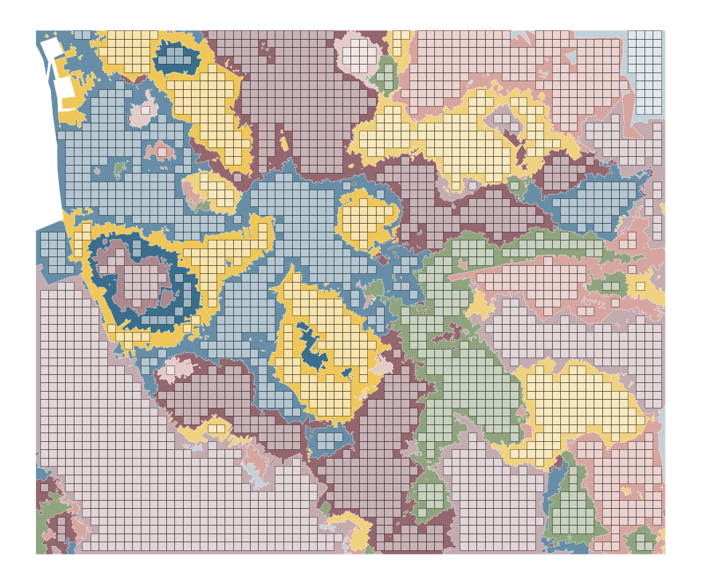
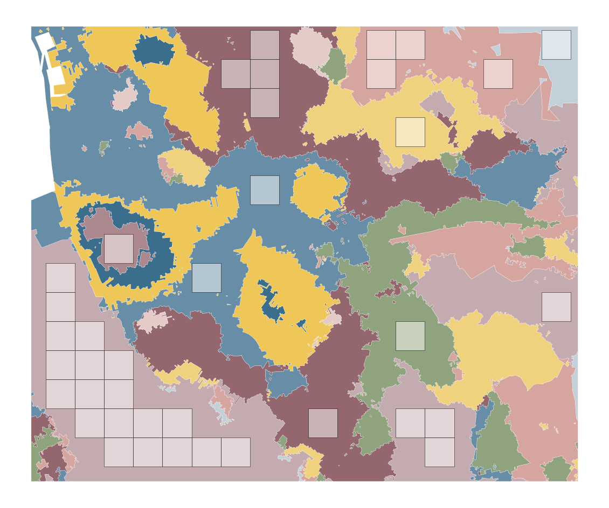

# Urban Grammar

    <h4>
    *Decoding the socio-economic landscape with satellite imagery*
    </h4>

<SMALL>
**Workshop on Migration, Climate Change and
Economic Development   Universidad de Zaragoza**
</SMALL>

<table>
    <col width="50%">
    <col width="50%">
    <tr>
        <td>
            

                <a href="https://darribas.org"><b>Dani Arribas-Bel</b></a>
                 `@darribas`
            

        </td>
        <td>
            

                <a href="https://martinfleischmann.net/"><b>Martin Fleischmann</b></a>
                 `@martinfleis`
            

        </td>
    </tr>

</table>

<table>
    <col width="33%">
    <col width="33%">
    <col width="33%">
    <tr>
        <td>
            
        </td>
        <td>
            
        </td>
        <td>
            
        </td>
    </tr>
</table>

#
## This talk...

... is _not_ (directly) about migration, climate change, or economic
development

... _is_ about using different data (&#x1F4E1; &#x1F30E;) to study
socio-economic systems

... uses cities as a *useful* illustration, but "the
sky is the limit"

## Cities and ...

<!-- https://www.unccd.int/news-stories/stories/world-cities-day-2020-better-city-better-life -->
<table>
<col width="33%" height="50%">
<col width="33%" height="50%">
<col width="33%" height="50%">
<tr>
    <td class='fragment fade-in-then-semi-out'>
**Climate**

- 3% land
- +60% energy
- 75% CO2

<small>[Source: UN](https://www.unccd.int/news-stories/stories/world-cities-day-2020-better-city-better-life)</small>
    </td>
    <td class='fragment fade-in-then-semi-out'>
**Development**

Urban Economics
    </td>
    <td class='fragment fade-in-then-semi-out'>
**Migration**

- Global hubs
- Pull
- Modulate
    </td>
<tr>
    <td>
</table>

## Cities and ...

<table>
<col width="33%" height="50%">
<col width="33%" height="50%">
<col width="33%" height="50%">
<tr>
    <td>
    

    

    </td>

    <td>
    

    

    </td>

    <td>
    

    

    </td>
</tr>
</table>

## Why satellite data?

- Low (marginal) cost
- Near real-time
- Ripe for disruption

i.e., this is our "20-year-big-thing"...

## But...

- Unstructured
- Big
- Only measure what can be "seen"

## Why satellite data?

<table>
<col width="33%" height="50%">
<col width="33%" height="50%">
<col width="33%" height="50%">
<tr>
    <td>
    

    

    </td>

    <td>
    

    

    </td>

    <td>
    

    

    </td>
<tr class='fragment'>
    <td>
    

    

    </td>

    <td>
    

    

    </td>

    <td>
    

    

    </td>
</tr>
</tr>
</table>

#
## {data-background-image="../fig/misc/urban_grammar_project.png" data-background-size="contain"}

## {data-transition="none"}

    *Characterisations of space based on form and function designed to understand urban environments*

## {data-transition="none"}

    *Characterisations of space based on form and function designed to understand urban
    environments*

## {data-transition="none"}

    *Characterisations of space based on form and function designed to understand urban
    environments*

## {data-transition="none"}

    *Characterisations of space based on form and function designed to understand urban
        environments*

## British Signatures

## {data-transition="none" data-background-image="../fig/sp_sig/classes.png" data-background-size="contain"}

## {data-transition="none" data-background-image="../fig/empirical/signatures_scottish_belt.png" data-background-size="cover"}
## {data-transition="none" data-background-image="../fig/empirical/signatures_scottish_belt_countryside.png" data-background-size="cover"}
## {data-transition="none" data-background-image="../fig/empirical/signatures_scottish_belt_periphery.png" data-background-size="cover"}
## {data-transition="none" data-background-image="../fig/empirical/signatures_scottish_belt_urban.png" data-background-size="cover"}

##

<table>
<col width="50%">
<col width="50%">
<tr>
    <td>
    

    

    </td>

    <td>
    

    

    </td>
</tr>
</table>

#
##

&#x1F4E1; &#x1F30E; + &#x1F4BB;  + &#x1F916;

## {data-transition="none" data-background-image="../fig/misc/nw_signatures.png" data-background-size="contain"}

## {data-transition="none" data-background-image="../fig/misc/nw_sentinel.png" data-background-size="contain"}

Source: <a href='https://s2maps.eu/'>Sentinel-2 cloudless</a>

## {data-transition="none" data-background-image="../fig/gisruk/mor_country.png" data-background-size="contain"}

Wild countryside (320x320m)

## {data-transition="none" data-background-image="../fig/gisruk/mor_urban.png" data-background-size="contain"}

Urbanity (320x320m)

## {data-transition="none" data-background-image="../fig/isuf/mor_all.png" data-background-size="contain"}

Predicted class (320x320m)

##

&#x1F4E1; &#x1F30E; + &#x1F4BB;  + &#x1F916;

***Why***

- Learn about Spatial Signatures (scale, context)
- Explore the role of space in NNs
- Work towards more frequent Spatial Signatures

#
## Experiment's dimensions

## Chip size
<table>
    <col width="25%">
    <col width="25%">
    <col width="25%">
    <col width="25%">
    <tr>
        <td>
        

        
         
        <SMALL>[74%]</SMALL>
        

        </td>
        <td>
        

        
         
        <SMALL>[57%]</SMALL>
        

        </td>
        <td>
        

        
         
        <SMALL>[35%]</SMALL>
        

        </td>
        <td>
        

        
         
        <SMALL>[13%]</SMALL>
        

        </td>
    </tr>
</table>

## (Spatial) data augmentation

## Model architecture

<table>
<col width="30%">
<col width="70%">
<tr>
<td>
`EfficientNetB4`

- Image Classification
- Multi-Output Regression
</td>
<td class='fragment'>

</td>
</tr>
</table>

## Evaluation

<table>
    <col width="35%">
    <col width="65%">
    <tr>
        <td>
`Metrics`

- Standard   [$\kappa$, accuracy, F1]()
- Spatial   [Joint Counts]()
        </td>
<td class='fragment'>
`Summarisation`
 

 

        </td>
    </tr>
</table>

#
## Results

## {data-transition="none" data-background-image="../fig/ai/results_table_1.png" data-background-size="contain"}
## {data-transition="none" data-background-image="../fig/ai/results_table_2.png" data-background-size="contain"}
## {data-transition="none" data-background-image="../fig/ai/results_table_3.png" data-background-size="contain"}

## Summarisation summary

- Extra ML pays off
- M.O.R. worse in general, better _within_ class
- Spatial context *always* improves performance
- Scale: larger is better, except for spatial patterning
- Spatial sliding rarely (within-class)

#
## Wrap up
## Wrap up

<small>[[Source]](https://images.gr-assets.com/hostedimages/1509307588ra/24308520.gif)</small>

## Wrap up

- We *need* to measure cities more, more frequently
- We *can* thanks to the &#x1F4E1; &#x1F30E; + &#x1F4BB;  + &#x1F916; combo
- *How* is still W.I.P., but with a stress on the **P**

# Urban Grammar

    <h4>
    *Decoding the socio-economic landscape with satellite imagery*
    </h4>

<SMALL>
**Workshop on Migration, Climate Change and
Economic Development   Universidad de Zaragoza**
</SMALL>

<table>
    <col width="50%">
    <col width="50%">
    <tr>
        <td>
            

                <a href="https://darribas.org"><b>Dani Arribas-Bel</b></a>
                 `@darribas`
            

        </td>
        <td>
            

                <a href="https://martinfleischmann.net/"><b>Martin Fleischmann</b></a>
                 `@martinfleis`
            

        </td>
    </tr>

</table>

<table>
    <col width="33%">
    <col width="33%">
    <col width="33%">
    <tr>
        <td>
            
        </td>
        <td>
            
        </td>
        <td>
            
        </td>
    </tr>
</table>

#
## Appendix

## Building *Spatial Signatures* {data-transition="none"}

<SMALL>
**[STAGE]**
Delimiters
Enclosure
Anchors
Encl. Tess.
Characters
Clusters
Signatures
</SMALL>

<table>
<col width="33%">
<col width="33%">
<col width="33%">
<tr>
    <td>
    

    Enclosed Tessellation
    

    </td>
    <td>
    

    Embedding *form* & *function*
    

    </td>
    <td>
    

    Spatial Signatures
    

    </td>
</tr>

<tr>
    <td>
    

    

    </td>

    <td>
    

    

    </td>

    <td>
    

    

    </td>
</tr>

<tr>
    <td>
    

    +

    

    </td>

    <td>
    

    

    </td>

    <td>
    

    

    </td>
</tr>

<tr>
    <td>
    

    

    </td>

    <td>
    

    

    </td>

    <td>
    

    

    </td>
</tr>

</table>

## Meaningful spatial units

Enclosed tessellation

<table>
    <col width="25%" height="50%">
    <col width="25%" height="50%">
    <col width="25%" height="50%">
    <col width="25%" height="50%">
    <tr>
        <td>
            

                
            

        </td>

        <td>
            

                 
            

        </td>
        <td>
            

                 
            

        </td>

        <td>
            

                 
            

        </td>
    </tr>
</table>

## Hierarchy

<table>
    <col width="35%">
    <col width="75%">
    <tr>
        <td class='fragment fade-in-then-semi-out'>
            

            

        </td>
        <td class='fragment'>
            

            

        </td>
    </tr>
</table>

## Sub-classifications

<table>
<col width="50%">
<col width="50%">
<tr>
    <td>
    

    

    </td>

    <td>
    

    

    </td>
</tr>
</table>

